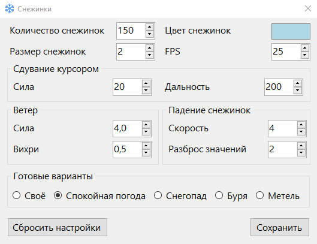
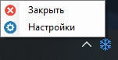

# Снежинки ❄
### [Скачать ❄ (Для Windows)](https://github.com/MixelTe/SnowFlakes/releases/download/v1.2/SnowFlakes.exe)

Снежинки, падающие поверх экрана.

Двигая мышку, можно сдувать снежинки.

Снежинки падают поверх всего, ничему не мешая.

Можно выделить область, где не будет видно снежинок.
* ЛКМ по иконке -> Выделение области
* Двойной ЛКМ по иконке -> Очистить область

### Можно настроить под себя

### Меню - ПКМ по иконке

