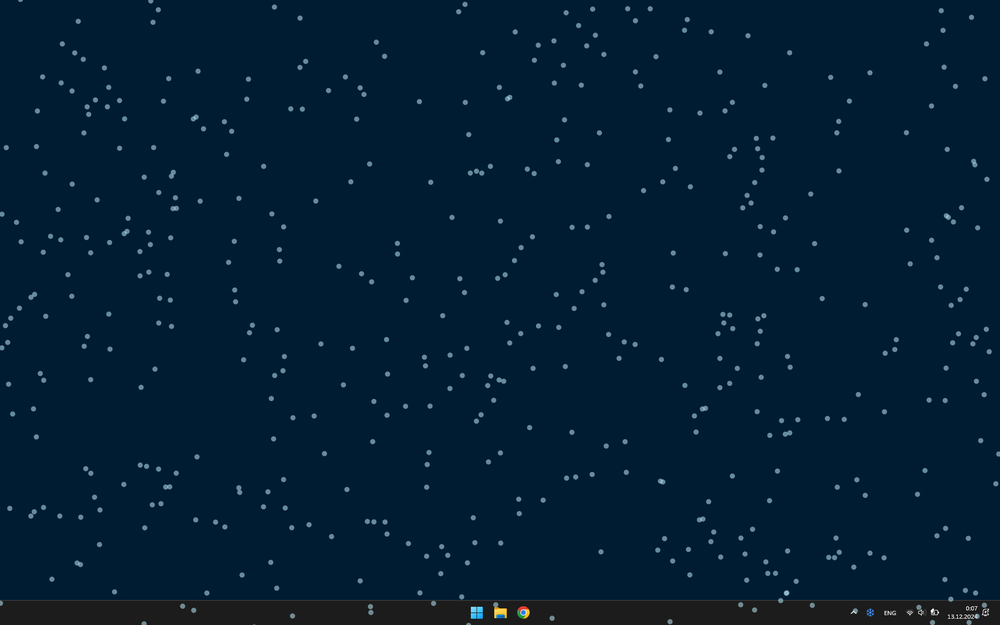
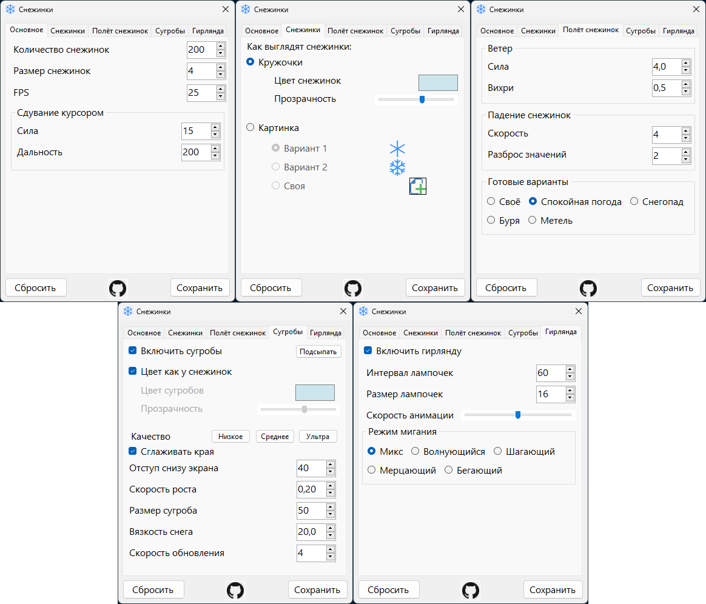
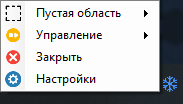

# Снежинки ❄
### [Скачать ❄ (Для Windows) v2.1.1](https://github.com/MixelTe/SnowFlakes/releases/download/v2.1.1/SnowFlakes.exe)

Снежинки, падающие поверх экрана.

Двигая мышку, можно сдувать снежинки.

Снежинки падают поверх всего, ничему не мешая.

Со временем появляются сугробы, которые можно разгребать мышкой. (Можно отключить)

Для снежинок можно выбрать любую картинку.

Можно выделить область, где не будет видно снежинок.
* ЛКМ по иконке -> Выделение области
* Двойной ЛКМ по иконке -> Очистить область

### Можно настроить под себя

### Меню - ПКМ по иконке

